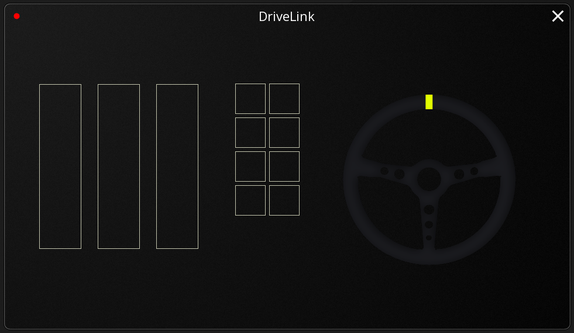

# DriveLink Desktop

**DriveLink Desktop** is the bridge application that allows you to use your Android phone as a high-performance racing game controller for Windows. It receives real-time motion and touch data from the DriveLink mobile app via UDP and translates it into virtual gamepad inputs. 

---

---

## Features
- **Low Latency**: Uses UDP for near-instantaneous input transmission.
- **Precise Steering**: Maps phone rotation (accelerometer/gyroscope) to the virtual steering axis.
- **Full Pedal Support**: Real-time feeding of 3 independent Throttle, Brake, and Clutch axes.
- **Custom Button Mapping**: Support for gear shifts, handbrake, and other actions using buttons.
- **Visual Feedback**: Real-time UI indicators for steering angle, pedal levels, and connection status.
- **Lightweight**: Written using C++ to keep performance impact at a minimum while running in the background.

## Overview
DriveLink Desktop acts as a "Bridge" in the system:
1. **Phone Sensor Data** : Captured by DriveLink Android App.
2. **Network Transmission** : Sent as UDP packets over local WiFi.
3. **Bridge Processing** : DriveLink Desktop receives packets and parses the data.
4. **Feeder Execution** : DriveLink Desktop feeds data into the virtual gamepad device.
5. **Game Reception** : Your game (BeamNG.drive, Assetto Corsa, etc.) sees the phone as a standard Steering Wheel/Gamepad.

## Requirements
- **OS**: Windows 10/11 (64-bit).
- **Visual C++ Redistrubutables**: [Download here](https://learn.microsoft.com/en-us/cpp/windows/latest-supported-vc-redist?view=msvc-170)
- **Local Network**: Phone and PC must be on the same WiFi network.

## Installation
1. **Download DriveLink**: Get the latest binary from the [Releases](https://github.com/DevBoiAgru/DriveLinkDesktop/releases) page.
2. **Install DriveLink**: Run the installer. It should install the app and vJoy driver automatically.
**Firewall troubleshooting**: Ensure UDP port `7001` is open in your Windows Firewall for the local network. If there is a dialog that asks for permission to allow access to the network, click **Allow access**.

## Usage
1. **Install apps**: Install the Android app on your mobile and Desktop app on your PC.
2. **Run DriveLink Desktop**: Open the application.
3. **Connect Phone**:
   - Note your PC's local IP address (e.g., `192.168.1.50`).
   - Enter this IP in the settings page in the DriveLink mobile app.
   - Go back to the home screen on the mobile app.
4. **Verification**: You should see the steering wheel and pedal indicators move in the Desktop UI.
5. **Game Setup**: Open your racing game and map the axes (Steering, Throttle, etc.) and the buttons to the actions of your choice.

## How It Works (Technical)
DriveLink uses a custom binary protocol over UDP for maximum performance.
- **Packet Parsing**: The application parses packets containing floats for axes and a bitmask for buttons.
- **Scaling**: Phone rotation in radians (-π/2 to π/2) is mapped linearly to the virtual gamepad absolute axis range.
- **Thread Safety**: Networking is handled on a dedicated thread to ensure the UI remains responsive and the feeding loop (100Hz) stays consistent.

## Troubleshooting
- **No connection (Red Dot)**: 
  - Verify phone and PC are on the same WiFi.
  - Double-check the PC's IP address.
  - Disable Windows Firewall temporarily to test.

## Contributing / Building from Source
DriveLink is built with **C++20** and **SFML 3.0**.

### Environment Setup
1. Install **Visual Studio 2022** with "Desktop development with C++".
2. Install **vcpkg** and integrate it: `vcpkg integrate install`.
3. Install dependencies: `vcpkg install sfml`.
4. Open the `.slnx` (or `.vcxproj`) in Visual Studio.
5. Build for **Release/x64**.

### Project Structure
- `src/core`: Networking and thread-safe input state.
- `src/platform`: Windows-specific vJoy implementation.
- `src/ui`: SFML-based UI components.
- `include/dl/core/Protocols.hpp`: Definition of the UDP packet format.

## Future Improvements
- Support for Linux (using `uinput`).
- Dynamic port configuration via UI.
- Force Feedback support.
- More interactive widgets like line charts on the interface.

---
I hope you enjoy it!
